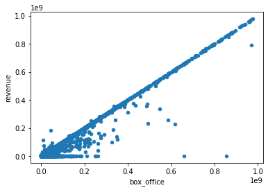
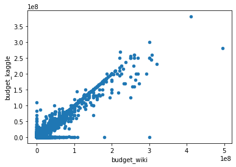
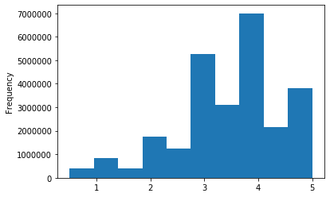
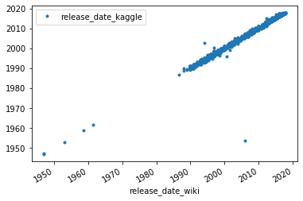
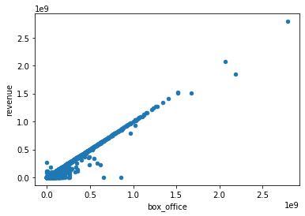
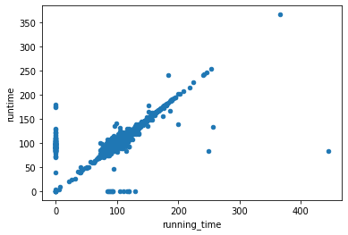

# Bootcamp: UCB-VIRT-DATA-PT-03-2020-U-B-TTH
## Bootcamp Challenge #8 - 5/3/2020
Bootcamp Challenge 8: Module movies-etl

### Dataset Used
- [wikipedia.movies.json](https://courses.bootcampspot.com/courses/140/files/37183/download?wrap=1)
- [zip file from Kaggle](https://www.kaggle.com/rounakbanik/the-movies-dataset/download)

### Challenge Objectives
The goals of this challenge are for you to:
- Create an automated ETL pipeline.
- Extract data from multiple sources.
- Clean and transform the data automatically using Pandas and regular expressions.
- Load new data into PostgreSQL.

### Challenge Findings
#### Box Office

#### Budget

#### Ratings Frequency

#### Release Date

#### Revenue

#### Running Time

#### .CSVs Generated from PostGresSQL Table exports.
[Movies Table Export](./db/movies_dump.csv)
[Ratings Table Export](./db/ratings_dump.csv)
 

### Assumptions Identified:
1. imdb_id Format: String format of the URL to extract imdb_id
2. Numeric String for :
#### 
